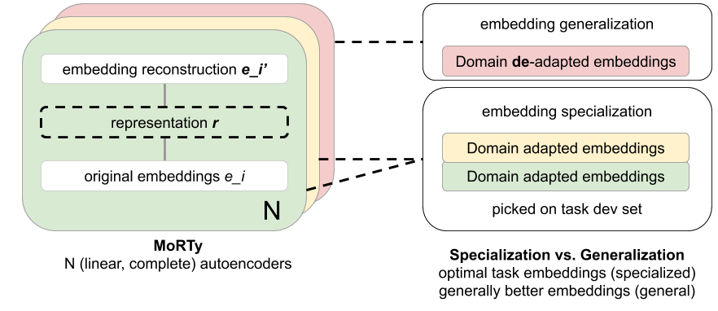

# MoRTy: a simple tool for Zero-shot domain adaptation of embeddings
MoRTy is a simple baseline method for **zero-shot domain adaptation** of embeddings that works especially well for **low-resource** applications, such as when *little pre-traing data is available*. It solves ...

### Problems
In practice, one has to chose which embedding model (FastText, Glove, TransformerX) is optimal for a task. While most pre-training methods like BERT are optimized for *'high-pretraining-resource'* domains, they can not be directly applied to *'low-pre-training resource settings'* and incure substantial training costs. In practice, using a Multi-GPU model to fine tune on a sub 10 MB supervision task can seem counterintuitive and affords preparation and maintanance costs, which limits scalability of future use cases or during deployment.  

### Acronym and architecture, model-code
<p align="center">
<b>M</b>enu <b>o</b>f <b>r</b>econstructing <b>t</b>ransformations <b>y</b>ields domain (<i>de-</i>)adapted embeddings
  </p>
<p align="center">
  
</p>

``` python
# See parameter settings in #Recipe section below or in MoRTy.py example (pc=OrderedDict ...)
class SparseOverCompleteAutoEncoder(torch.nn.Module):
    """ A sparse L1 autoencoder, that retrofits embeddings that are of the same (complete AE)
        or larger (overcomplete AE) dimension than the original embeddings.
    """
    def __init__(self, emb_dim, hidden_size, bias=True):
        super(SparseOverCompleteAutoEncoder, self).__init__()
        self.lin_encoder = nn.Linear(emb_dim, hidden_size, bias=bias) # no bias works too
        self.lin_decoder = nn.Linear(hidden_size, emb_dim, bias=bias)
        self.feature_size = emb_dim
        self.hidden_size = hidden_size
        self.l1weight = params['l1'] # had little effect on SUM-of-18-tasks performance
        self.act = params['activation'] # linear was best for SUM-of-18-tasks score

    def forward(self, input):
        r = self.act(self.lin_encoder(input))
        if self.l1weight is not None: # sparsity penalty
            x_ = self.lin_decoder(L1Penalty.apply(r, self.l1weight))
        else:
            x_ = self.lin_decoder(r) # no sparsity penalty
        # x_ for training via loss, r are the new/retrofit embeddings after training (1-epoch)
        return x_, r  
```

### Recipe: :stew:
1. **pre-train**/ download **embeddings** `E_org` (using FastText is recommended for out-of-vocabulary abilities)
2. **Produce** `k` randomly autoencoded/ retro-fitted **versions** `E_r1 ... E_rk` of the original embedding `E_org`
3. **Chose** the **optimal** `E_ro` form the `k` `E_ri` according to:
+ **Embedding specialization**/ *Supervised use case:* a supervised end-task's develoment set (`E_ri` is now essentially a hyperparameter). To save computation, consider selecting the optimal embedding `E_ro` on a low-cost baseline such as logistic regression or FastText and then use the found `E_ro` in the more complex model. Also works to find optimal `E_ro` in multi-input/channel + multi-task settings.
+ **Embedding specialization**/ *Proxy supervised use case:* use the dev/test set of a related (benchmark) task to find optimal embeddings `E_ro`. *'Proxy-shot' setting*.
+ **Embedding generalization**/ *Zero-shot use case:* when training embeddings `E_ri` for 1 epoch on different pre-training corpora sizes (WikiText-2/-103, CommonCrawl) `E_org` we found MoRTy to always produce score improvements (between 1-9%) over the sum of 18 word-embedding benchmark tasks. This means that MoRTy *generalizes* embeddings 'blindly'.

### Properties/ use cases
+ Zero- to few/proxy-shot domain adaptation
+ train in seconds :clock1:
+ low RAM requirements, no GPU needed -- low carbon footprint, MoRTy :hearts: :earth_africa:
+ saves annotation 
+ usable to train simpler models (lower model extension costs/time)
+ cheaply produce that last 5% performance increase for customers :smirk:
+ MoRTy [is not a Muppet](https://en.wikipedia.org/wiki/Morty_Smith) 

# Usage :wrench:
+ `MoRTy.py` contains example code that takes a .vec file (e.g. `data/wikitext2_FastText_SG0.vec` in `#word\tembedding_values format`) of FastText or GloVe pretrained embeddings and produces new autoencoded versions of those embeddings. The parameters in the `pc`can be adjusted. Though the script supports hyper parameter exploration via extending the value list in the `pc` object, this should not be neccessary.

# Dependencies
```
python          3.6 # due to word embedding benchmark
pandas          0.25.0
scikit-learn    0.21.2
pytorch         0.4.1
tdqm            4.32.1
```
requirements.txt for the rest

# Paper and bibtex Reference :scroll:
[MoRTy: Unsupervised Learning of Task-specialized Word Embeddings
by Autoencoding](https://www.aclweb.org/anthology/W19-4307), Nils Rethmeier, Barbara Plank, Repl4NLP@ACL, Italy, 2019 
```
@inproceedings{rethmeier-plank-2019-morty,
    title = "{M}o{RT}y: Unsupervised Learning of Task-specialized Word Embeddings by Autoencoding",
    author = "Rethmeier, Nils  and
      Plank, Barbara",
    booktitle = "Proceedings of the 4th Workshop on Representation Learning for NLP (RepL4NLP-2019)",
    month = aug,
    year = "2019",
    address = "Florence, Italy",
    publisher = "Association for Computational Linguistics",
    url = "https://www.aclweb.org/anthology/W19-4307",
    pages = "49--54",
}
```
